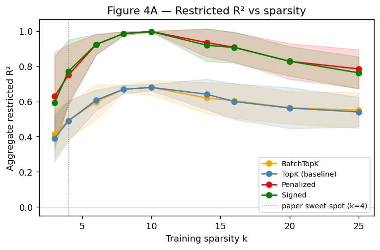
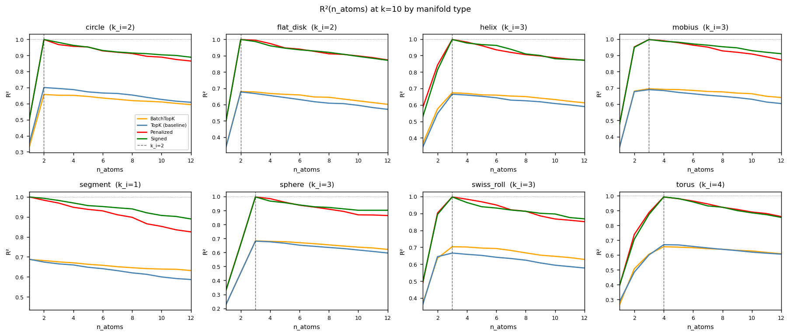

# Geometric SAE features

Based on [this](https://arxiv.org/pdf/2604.28119) paper, how to tweak SAEs to learn geometric features? 

Main idea: to achieve compact capture, SAE features should look like coordinates on their respective manifolds. Two methods are implemented in this repo:
1. `SignedBatchTopKSAE` - inherits `BatchTopKSAE` from `sae_lens` but keeps the top k **absolute-value** activations
2. `CoActPenalizedSAE` - same as above but also adds a coherence penalty on coactivating features

## Results

Aggregate $R^2$ (equivalent of fig 4a left in paper)

Aggregate $R^2$ per shape (fig 4a right)

More plots coming soon...

## AI Usage

Ideas are my own. Claude code used quite heavily to write code. 