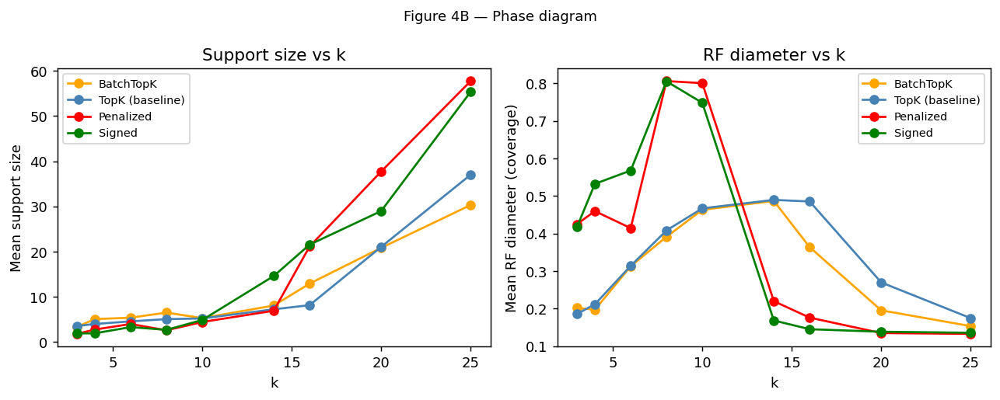
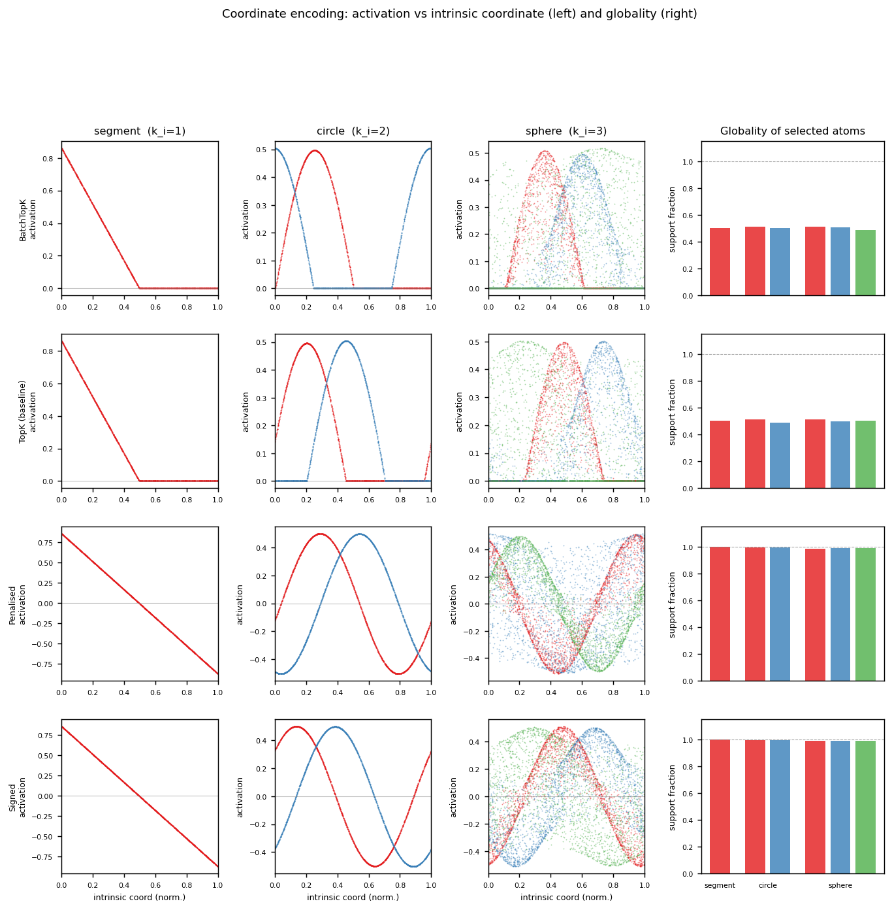

# Geometric SAE features

Based on [this](https://arxiv.org/pdf/2604.28119) paper, how to tweak SAEs to learn geometric features? 

Main idea: to achieve *subspace capture*, SAE features should look like coordinates on their respective manifolds. Within a manifold, the feature directions should be orthogonal to more efficiently encode a basis. Between manifolds, different coordinates should not interfere too much (this is the role of the incoherence assumption in Theorem 1).

Two approaches are implemented in this repo:
1. `SignedBatchTopKSAE` - inherits `BatchTopKTrainingSAE` from `sae_lens` but keeps the top k **absolute-value** activations. This makes it easier for features to encode coordinates since activations may be negative.
2. `CoActPenalisedSAE` - same as above but also adds a coherence penalty on decoder directions weighted by how often features co-activate. This actively encourages the features to span the embedding spaces as compactly as possible. 


## Results

Overall, `SignedBatchTopKSAE` seems to achieve compact capture more consistently than the paper's baseline, with `CoActPenalisedSAE` adding a negligible improvement beyond that. I'm honestly surprised at how well `SignedBatchTopKSAE` seems to work, and how little improvement `CoActPenalisedSAE` brings.

Aggregate $R^2$ (equivalent of fig 4a left in paper)


Aggregate $R^2$ per shape (fig 4a right)


Support size/RF field (appendix E)



Instrinsic coordinate vs feature coordinate (left) and how often the same features fire for a given shape (higher is better) (right)



Look at those triggy curves!

## Usage

Setup 
```bash
pip install -r requirements.txt
```

Training:
```python
from geo_sae.train import make_trainer, generate_shared_data
from geo_sae.data import PAPER_CONFIG
from geo_sae.results.results import collate_snapshots


train_data, eval_data = generate_shared_data(PAPER_CONFIG, device=device)

# variant = "baseline" | "baseline_batch" | "signed" | "penalised"
trainer = make_trainer(PAPER_CONFIG, variant="baseline", k=k, device=device, train_data=train_data, eval_data=eval_data)

#train
snapshots = trainer.train(return_snapshot=True)

# save snapshots for plotting
pickle.dump(collate_snapshots(snapshots), open("results/snapshots/snapshots.b", "wb"))
```

Plotting:
```bash
python3 results/generate_plots.py results/snapshots/snapshots.b
```

## Next steps

- fit Ising model
- steering 
- run on real LLMs

## AI Usage

Ideas are my own. Claude code used quite heavily to write code. 